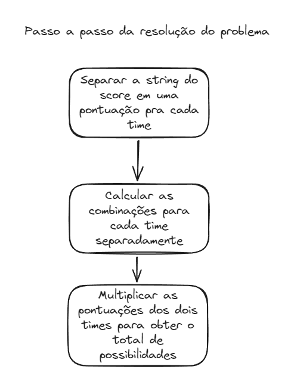
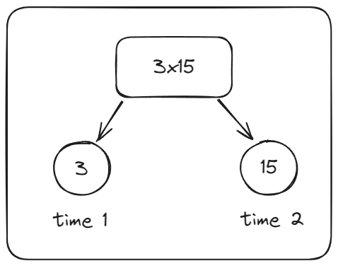

# Studio Sol - Prova prática Back-end (05-2024)

## Tabela de conteúdos

<!-- TODO: Criar tabela de conteúdos do README -->

- [Algoritmo para calcular as combinações](#algoritmo-para-calcular-as-combinações)

## Introdução

Esse projeto é a minha prova prática para o processo seletivo de Back-end da Studio Sol em maio de 2024.

O problema consiste em avaliar quantas combinações de pontuações são possíveis para se obter um determinado placar em uma partida de futebol americano.

### Pontuações possíveis

- Touchdown (6 pontos)
  - Extra touchdown (até 2 pontos obtidos **apenas** após marcar um touchdown)
- Field goal (3 pontos)

## Stack

- Linguagem back-end: Golang
- Biblioteca para criação de servidor GraphQL: [gqlgen](https://github.com/99designs/gqlgen)
- Bibliotecas para testes: [ginkgo](https://github.com/onsi/ginkgo) e [gomega](https://github.com/onsi/gomega)
  > Essas bibliotecas usam sintaxe inspirada em BDD, o que ajuda na clareza e organização dos testes.
- Ferramenta para pipeline: Github Actions
  > O projeto tem um [pipeline do Github Actions](.github/workflows/main.yml) que faz o build do projeto e executa os testes usando _ginkgo_.
- Ferramenta de containerização: Docker

## Como executar a aplicação

### Localmente

Para executar localmente você precisa ter `go 1.20` instalado.

```bash
# Navegue até pasta raiz do projeto
cd <pasta-onde-está-o-projeto>/studio-sol-backend-test-2

# Execute a aplicação
go run cmd/server/server.go
```

A aplicação decide a porta pela variável de ambiente `PORT`. Caso nenhuma seja fornecida, a porta padrão é a 8080. As rotas são as seguintes:

Endpoint graphql: http://localhost:8080/graphql

Playground GraphQL: http://localhost:8080

> Lembre-se de trocar a porta se tiver fornecido um valor para a variável de ambiente `PORT`.

### Dockerfile

Caso não tenha `go 1.20` instalado, pode ser mais simples utilizar um container para testar.

```bash
# Navegue até pasta raiz do projeto
cd <pasta-onde-está-o-projeto>/studio-sol-backend-test-2

# Faça o build da imagem
docker build -t studio-sol-backend-test-2 .

# Rode o container
docker run -d -p 8080:8080 --name studio-sol-backend-test-2 studio-sol-backend-test-2
```

As rotas são as seguintes:

Endpoint graphql: http://localhost:8080/graphql

Playground GraphQL: http://localhost:8080

Você também pode passar outra porta ser usada pela aplicação _dentro do container_:

```bash
docker run -d -e PORT=8000 -p 8080:8000 --name studio-sol-backend-test-2 studio-sol-backend-test-2
```

## Como executar os testes

Esse projeto usa o [ginkgo](https://github.com/onsi/ginkgo) como ferramenta de testes. Então, para executar os testes, você precisa da [Ginkgo CLI](https://onsi.github.io/ginkgo/#installing-ginkgo) instalada em sua máquina.

## Processo de desenvolvimento

Esta seção descreve as etapas que eu segui na construção do projeto.

### Configurar projeto inicial

1. Inicializar projeto com o [gqlgen](https://github.com/99designs/gqlgen)
2. Criar Dockerfile do projeto (usar imagem scratch para gerar um container mais leve)
3. Instalar bibliotecas de teste: ginkgo e gomega
4. Criar pipeline de build do projeto usando Github Actions
5. Criar schema GraphQL

- Criar mutation `verify` e modelo de saída
- Criar query `hello`. **Essa query foi necessária para o GraphQL playground conseguir recuperar o schema do app. Não funciona se não tiver no mínimo uma definição de query.**

### Criar testes de integração

Decidi criar testes de integração como base antes de começar o desenvolvimento. Quando esses testes passarem, quer dizer que tudo está funcionando (configuração da mutation e dos models GraphQL, algoritmo para cálculo das combinações). Inicialmente usei os dois casos de teste fornecidos no enunciado.

## Algoritmo para calcular as combinações

Eu quebrei a solução do problema em 3 partes:


### Separar a string do score

Para separar a string do score em uma pontuação para time, eu só precisava quebrar no _'x'_ e converter cada um dos lados para `int`.



### Calcular as combinações para cada time

Dada a pontuação total que o time fez na partida de futebol americano, precisamos calcular quantas são as combinações de jogadas possíveis que resultam na pontuação total.

Para encontrar essas combinações, precisamos analisar as árvore a partir de cada tipo de jogada. Por exemplo, para uma pontuação total de 15 pontos, eu posso começar analisando as jogadas que envolvem um _field goal_.

Ao subtrair os 3 pontos de um field goal da pontuação total, fica 12 pontos. Todas as combinações de jogadas que resultam em 12 pontos, fazem parte da árvore de combinações de 15 pontos.

Se, ao subtrair uma jogada de uma pontuação, eu encontrar uma árvore de possibilidades com 0 combinações, quer dizer que essa pontuação não é possível no futebol americano. Por exemplo, ao subtrair um _field goal_ (3 pontos) de uma pontuação de 5, obtém-se 2 pontos. Que não é uma pontuação possível no futebol americano. Logo, não existe combinação com _field goal_ que chegue a 5 pontos.

> Na verdade, não é possível obter 5 pontos no futebol americano. O algoritmo teria certeza disso depois de repetir o mesmo processo para os outros 3 tipos de jogadas.

Essa lógica pode ser seguida recursivamente até encontrar o total de combinações. Além disso, as quantidades de combinações possíveis podem ser armazenadas em um array após calculadas para serem reutilizadas para pontuações mais altas. O pseudo-código representa a implementação desse algoritmo:

```
funcao contar_combinacoes(total_pontos)
  se total_pontos < 0
    retornar 0

  // guarda todas as combinações possíveis de pontuação de 0 a total_pontos
  combinacoes = array[total_pontos + 1]

  // a única maneira de terminar com 0 pontos é não marcar nenhuma jogada
  combinacoes[0] = 1

  // pontos para cada jogada
  jogadas_possiveis = [3, 6, 7, 8]

  para jogada em jogadas_possiveis
    para i de jogada ate tamanho(combinacoes)
      // soma as combinacoes complementares a cada jogada possivel
      // para pontuacoes impossiveis sempre vai somar 0
      combinacoes[i] += combinacoes[i - jogada]

  retornar combinacoes[total_pontos]
```

### Multiplicar as pontuações dos dois times

Por fim, sabendo quantas combinações são possíveis para cada time, basta multiplicar essas quantidades para obter o total de possibilidades.

Se algum dos times tiver uma pontuação impossível (0 possibilidades), a multiplicação também vai resultar em 0, indicando que é um `score` impossível no futebol americano.

Senão, o resultado da multiplicação é o total de possibilidades de jogadas que permite chegar no placar fornecido. Ou seja, cada combinação possível do time 1 combinada com cada combinação possível do time 2.
